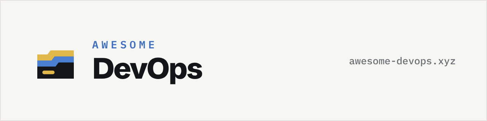

# Awesome DevOps

  <a href="https://awesome-devops.xyz">
    <picture>
      <source media="(prefers-color-scheme: dark)" srcset=".github/assets/readme-banner-dark.png">
      
    </picture>
  </a>

> A curated list of platforms, tools, practices and resources to create, improve DevOps culture and SRE Team in the organization.

DevOps is the combination of cultural philosophies, practices, and tools that increases an organization’s ability to deliver applications and services at high velocity: evolving and improving products at a faster pace than organizations using traditional software development and infrastructure management processes. This speed enables organizations to better serve their customers and compete more effectively in the market.

Browse, search and filter the list at **[awesome-devops.xyz](https://awesome-devops.xyz)**.

Each entry ends with tags: `oss` open source, `free` free plan or free to use, `paid` paid plans or support, `self-hosted` can run on your own infrastructure without being open source.

## Contents

- [Cloud Platforms](#cloud-platforms)
- [Open Source Cloud Platforms](#open-source-cloud-platforms)
- [Operating Systems](#operating-systems)
- [Package Management & System Configuration](#package-management--system-configuration)
- [Distributed Filesystems](#distributed-filesystems)
- [Applications Platforms](#applications-platforms)
- [Internal Developer Platforms](#internal-developer-platforms)
- [Container Image Registry](#container-image-registry)
- [Automation & Orchestration](#automation--orchestration)
- [Productivity Tools](#productivity-tools)
- [Continuous Integration & Delivery](#continuous-integration--delivery)
- [Source Code Management](#source-code-management)
- [Web Servers](#web-servers)
- [SSL](#ssl)
- [Databases](#databases)
- [Observability and Monitoring](#observability--monitoring)
- [Service Discovery & Service Mesh](#service-discovery--service-mesh)
- [Chaos Engineering](#chaos-engineering)
- [API Gateway](#api-gateway)
- [Code review](#code-review)
- [Distributed messaging](#distributed-messaging)
- [Programming Languages](#programming-languages)
- [Chat and ChatOps](#chat-and-chatops)
- [Secret Management](#secret-management)
- [Security](#security)
- [Sharing](#sharing)
- [VPN](#vpn)
- [Resources](#resources)
  - [Books](#books)
  - [Conferences](#conferences)
  - [Blogs](#blogs)
  - [DevOps Roadmap](#devops-roadmap)

---

## Cloud Platforms

*Public and Private Cloud Platforms.*

- [Amazon Web Services (AWS)](https://aws.amazon.com/) - Cloud Computing Services. `free` `paid`
- [Google Cloud Platform (GCP)](https://cloud.google.com/) - Cloud Computing Services. `free` `paid`
- [Azure](https://azure.microsoft.com/) - Cloud Computing Platform & Services. `free` `paid`
- [Alibaba Cloud](https://us.alibabacloud.com/) - Integrated suite of cloud products and services. `free` `paid`
- [Oracle Cloud](https://www.oracle.com/cloud/) - Comprehensive and fully integrated stack of cloud applications and platform services. `free` `paid`
- [DigitalOcean](https://www.digitalocean.com/) - Helping developers easily build, test, manage, and scale applications of any size. `paid`
- [Scaleway](https://www.scaleway.com/) - Single way to create, deploy and scale your infrastructure in the cloud. `paid`
- [Vultr](https://www.vultr.com/) - Easily deploy cloud servers, bare metal, and storage worldwide. `paid`
- [IBM Cloud](https://www.ibm.com/cloud) - Tools, data & APIs to make AI real now. `free` `paid`
- [Interserver](https://www.interserver.net/) - Cloud VPS, Linux VPS, Windows VPS, dedicated servers and web hosting services. `paid`
- [Linode](https://linode.com/) - Accelerate innovation in the cloud, virtual computing must be more accessible, affordable, and simple. `paid`
- [Kinsta](https://kinsta.com/application-hosting/) - Create and deploy web applications and databases in minutes. `free` `paid`
- [Equinix](https://www.equinix.com/) - Global data center and colocation provider for enterprise network and cloud computing. `paid`
- [Clever Cloud](https://clever.cloud/) - European Platform as a Service (PaaS) with managed databases and object storage. `paid`

## Open Source Cloud Platforms

*Private, Public and Hybrid open-source Cloud Platforms.*

- [Openstack](https://www.openstack.org/) - Open source software for creating private and public clouds. `oss`
- [Apache CloudStack](https://cloudstack.apache.org/) - Designed to deploy and manage large networks of virtual machines. `oss`
- [OpenNebula](https://opennebula.org/) - Build Private Clouds and manage Data Center virtualization based on KVM, LXD and VMware. `oss` `paid`
- [Eucalyptus](https://www.eucalyptus.cloud/) - Building AWS-compatible private and hybrid clouds. `oss`
- [DC/OS](https://dcos.io/) - Distributed operating system based on the Apache Mesos distributed systems kernel. `oss`
- [Apache Mesos](http://mesos.apache.org/) - Program against your data center like it’s a single pool of resources. `oss`
- [Fakecloud](https://github.com/faiscadev/fakecloud) - Free, open-source local AWS cloud emulator for development and testing. `oss`
- [Localstack](https://github.com/localstack/localstack) - Fully functional local AWS cloud stack. Develop and test your cloud & Serverless apps offline. `oss` `paid`

## Operating Systems

*Operating Systems - Server Platform.*

- [Ubuntu](https://ubuntu.com/) - Enterprise Open Source and Linux. `oss` `paid`
- [Rocky Linux](https://rockylinux.org/) - Open-source enterprise operating system designed to be 100% bug-for-bug compatible with Red Hat Enterprise Linux. `oss`
- [CoreOS](http://coreos.com/) - The pioneering lightweight container host. `oss`
- [OSv](http://osv.io/) - Versatile modular unikernel designed to run unmodified Linux applications securely on micro-VMs in the cloud. `oss`
- [Atomic](http://www.projectatomic.io/) - Use immutable infrastructure to deploy and scale your containerized applications. `oss`
- [Photon](https://github.com/vmware/photon) - Linux container host optimized for cloud-native applications, cloud platforms, and VMware infrastructure. `oss`

## Package Management & System Configuration

*Builds packages in isolation from each other.*

- [Nix/NixOS](https://nixos.org/) - A tool that takes a unique approach to package management and system configuration. `oss`

## Distributed Filesystems

*Network distributed filesystems.*

- [Ceph](https://ceph.io/en/) - Highly scalable object, block and file-based storage under one whole system. `oss`
- [Gluster](https://www.gluster.org/) - Free and open source software scalable network filesystem. `oss`
- [LINBIT](https://www.linbit.com/en/) - Create, remove, and replicate block storage devices for datacenter scale environments. `oss` `paid`
- [XtreemFS](http://www.xtreemfs.org/) - Fault-tolerant distributed file system for all storage needs. `oss`
- [min.io](https://min.io/) - High-performance, distributed object storage system. `oss` `paid`

## Applications Platforms

*Applications management platforms, Containers platform and Containers management.*

- [Openshift](https://www.openshift.com/) - The Kubernetes platform for big ideas. `paid` `self-hosted`
- [Cycle.io](https://cycle.io/) - DevOps platform for building platforms. Handle container orchestration, load-balancing, monitoring, and more from a single control plane. `paid`
- [Dokku](https://dokku.com/) - Helps you build and manage the lifecycle of applications. `oss` `paid`
- [Cloud 66](https://www.cloud66.com/) - DevOps as a service that helps to build, deploy and manage any application on any cloud or server. `paid`
- [Docker](https://www.docker.com/) - Create, deploy, and run applications by using containers. `oss` `paid`
- [Docker Compose](https://github.com/docker/compose) - Define and run multi-container applications with Docker. `oss`
- [Docker Swarm](https://github.com/docker/swarm) - Docker-native clustering system. `oss`
- [Kubernetes](https://kubernetes.io/) - Automating deployment, scaling, and management of containerized applications. `oss`
- [LXC](https://linuxcontainers.org/) - Lets Linux users easily create and manage system or application containers. `oss`
- [Rancher](https://rancher.com/) - Lets you deliver Kubernetes-as-a-Service. `oss` `paid`
- [OpenVz](https://openvz.org/) - Container-based virtualization for Linux. `oss`
- [Singularity](https://sylabs.io/singularity/) - Run the application from the local environment to the cloud. `oss` `paid`
- [AppScale](https://github.com/AppScale/appscale) - Easy-to-manage serverless platform for building and running scalable web and mobile applications. `oss`
- [Kata Containers](https://katacontainers.io/) - Building lightweight virtual machines that seamlessly plug into the containers ecosystem. `oss`
- [K3S](https://k3s.io/) - The certified Kubernetes distribution built for IoT and Edge computing. `oss`
- [Podman](https://github.com/containers/podman) - A tool for managing OCI containers and pods. `oss`
- [Linx](https://linx.software) - General-purpose low-code platform for building and hosting backend solutions. `free` `paid` `self-hosted`
- [Piku](https://github.com/piku/piku) - The tiniest PaaS you've ever seen. Piku allows you to do git push deployments to your own servers. `oss`
- [OrbStack](https://orbstack.dev/) - fast, light, and easy way to run Docker containers and Linux on MacOS. `free` `paid`
- [Canine](https://canine.sh/) - Deploy applications to Kubernetes as easily as deploying to Heroku. `oss` `paid`
- [AZIN](https://azin.run/) - BYOC deployment platform. Deploy to your own GCP account with git-push, no Kubernetes config needed. GKE Autopilot under the hood. `paid`
- [vCluster](https://vcluster.sh/) - A open source project that helps you create virtual clusters. `oss` `paid`
- [devpod](https://devpod.sh/) - Open-source, codebases-like tool that creates reproducible developer environments, supporting numerous providers (Kubernetes, AWS, GCP, etc.). `oss`
- [KubeStellar Console](https://console.kubestellar.io/) - Open source AI-powered multi-cluster Kubernetes dashboard with real-time observability, AI-guided operations, and 20+ CNCF integrations (Argo, Kyverno, Prometheus, Grafana, Istio, Flux, Falco, OPA/Gatekeeper). CNCF Sandbox project. `oss`

## Internal Developer Platforms

*Tools, services and processes that support and accelerate software development.*

- [Port](https://www.getport.io/) - A platform for building no-code, holistic, Internal Developer Portals. `free` `paid` `self-hosted`
- [Backstage](https://backstage.io/) - An open platform for building developer portals. `oss`
- [Kratix](https://kratix.io/) - A framework used by platform teams to build the custom platforms tailored to their organisation. `oss` `paid`
- [Qovery](https://www.qovery.com/) - Enterprise Kubernetes management platform for deploying applications on AWS, GCP, Azure, and Scaleway. Includes Terraform provider, CLI, API, and an [AI Agent Skill](https://github.com/Qovery/qovery-skills) for deploying from AI coding tools like Claude Code, Cursor, and OpenCode. `free` `paid`
- [OpenChoreo](https://openchoreo.dev/) - A complete, modular, open-source developer platform. `oss`

## Container Image Registry

*Container Image registry.*

- [Quay](https://www.projectquay.io/) - Container image registry that enables you to build, organize, distribute, and deploy containers. `oss` `paid`
- [Dockyard](https://github.com/Huawei/dockyard) - Container & Artifact Repository. `oss`
- [Harbor](https://goharbor.io/) - An open source trusted cloud native registry project that stores, signs, and scans content. `oss`
- [GitHub Container Registry](https://github.blog/2020-09-01-introducing-github-container-registry/) - Container registry free for public images. `free` `paid`

## Automation & Orchestration

*Tools for automation, orchestration, deployment, provisioning and configuration management.*

- [Ansible](https://www.ansible.com/) - Simple IT automation platform that makes your applications and systems easier to deploy. `oss` `paid`
- [Salt](https://saltproject.io/) - Automate the management and configuration of any infrastructure or application at scale. `oss`
- [Puppet](https://puppet.com/) - Unparalleled infrastructure automation and delivery. `oss` `paid`
- [Chef](https://www.chef.io/) - Automate infrastructure and applications. `oss` `paid`
- [Juju](https://jaas.ai/) - Simplifies how you configure, scale and operate today's complex software. `oss` `paid`
- [Rundeck](https://www.rundeck.com/) - Runbook Automation For Modernizing Your Operations. `oss` `paid`
- [StackStorm](https://stackstorm.com/) - Connects all your apps, services, and workflows. Automate DevOps your way. `oss`
- [Bosh](https://www.cloudfoundry.org/bosh/) - Release engineering, deployment, and lifecycle management of complex distributed systems. `oss`
- [Cloudify](https://cloudify.co/) - Connect, Control, & Automate from core to edge: unlimited locations, clouds and devices. `oss` `paid`
- [Tsuru](https://tsuru.io/) - An extensible and open source Platform as a Service software. `oss`
- [Fabric](http://www.fabfile.org/) - High-level Python library designed to execute shell commands remotely over SSH. `oss`
- [Capistrano](https://capistranorb.com/) - A remote server automation and deployment tool. `oss`
- [Mina](http://nadarei.co/mina/) - Really fast deployer and server automation tool. `oss`
- [Terraform](https://www.terraform.io/) - use Infrastructure as Code to provision and manage any cloud, infrastructure, or service. `free` `paid` `self-hosted`
- [Pulumi](https://www.pulumi.com/) - Modern infrastructure as code platform that allows you to use familiar programming languages and tools to build, deploy, and manage cloud infrastructure. `oss` `paid`
- [Packer](https://www.packer.io/) - Build Automated Machine Images. `free` `paid` `self-hosted`
- [Vagrant](https://www.vagrantup.com/) - Development Environments Made Easy. `free` `self-hosted`
- [Foreman](https://theforeman.org/) - Complete lifecycle management tool for physical and virtual servers. `oss`
- [Nomad](https://learn.hashicorp.com/nomad) - Deploy and Manage Any Containerized, Legacy, or Batch Application. `free` `paid` `self-hosted`
- [OctoDNS](https://github.com/github/octodns) - Managing DNS across multiple providers. DNS as code. `oss`
- [ManageIQ](https://www.manageiq.org/) - Manage containers, virtual machines, networks, and storage from a single platform. `oss`
- [Ignite](https://github.com/weaveworks/ignite) - Open Source Virtual Machine (VM) manager with a container UX and built-in GitOps management. `oss`
- [Selefra](https://github.com/selefra/selefra) - An open-source policy-as-code software that provides analytics for multi-cloud and SaaS. `oss`
- [Spacelift](https://spacelift.io/) - Flexible orchestration solution for IaC development. `free` `paid`
- [Atlantis](https://www.runatlantis.io/) - Terraform Pull Request Automation. `oss`
- [KubeVela](https://kubevela.io/) - Modern application delivery platform that makes deploying and operating applications across today's hybrid, multi-cloud environments easier, faster and more reliable. `oss`
- [Stacktape](https://stacktape.com) - Developer-friendly Infrastructure as a Code framework built on top of AWS. `free` `paid`
- [Score](https://score.dev) - Open Source developer-centric and platform-agnostic workload specification. `oss`
- [Stategraph](https://stategraph.com) - Terraform and OpenTofu without the state file bottleneck. `paid`
- [Meshery](https://meshery.io/) - An open-source, cloud native manager that enables the design and management of all Kubernetes-based infrastructure and applications. `oss` `paid`
- [Digger](https://digger.dev) - Open Source Infrastructure as Code management tool that runs within your CI/CD system. `oss` `paid`
- [Deployment.io](https://deployment.io) - DevOps co-pilot for developers to automate deployments to AWS. `free` `paid`
- [RapidForge.io](https://rapidforge.io/) - Create end points, forms and tasks using scripts. Automate your workflows. `oss`
- [Terrateam](https://terrateam.io) - Open-source alternative to Terraform Cloud/Enterprise, GitOps-first with native GitHub integration and designed for scale, security, and reliability. `oss` `paid`
- [Scalr](https://scalr.com/) - Drop-in Terraform Cloud alternative, usage-based pricing, unlimited concurrency. `free` `paid`
- [CloudRay](https://cloudray.io) - Centralised platform for managing servers, organizing Bash scripts, and automating infrastructure tasks across cloud and virtual machines. `free` `paid`

## Productivity Tools

*Tools and services which increase productivity, developer velocity and developer experience.*

- [tenv](https://github.com/tofuutils/tenv) - streamline IaC version manager for OpenTofu, Terraform, Terragrunt and Atmos, written in Go. `oss`
- [Telert](https://github.com/navig-me/telert) - Get alerts when terminal commands finish via Telegram, Slack, Audio, etc. `oss`
- [pyenv](https://github.com/pyenv/pyenv) - Simple Python version management. `oss`
- [tfenv](https://github.com/tfutils/tfenv) - Terraform version manager. `oss`
- [Kanvas](https://kanvas.new) - a collaborative tool with visual interface for designing and operating infrastructure. `free` `paid` `self-hosted`
- [kubefwd](https://github.com/txn2/kubefwd) - Bulk port forwarding Kubernetes services for local development. `oss`
- [claws](https://github.com/clawscli/claws) - A terminal UI for managing AWS resources across multiple profiles and regions with vim-style navigation. `oss`
- [purple](https://github.com/erickochen/purple) - SSH client with AWS/GCP/Azure sync, Docker/Podman and SCP transfers. `oss`
- [mirrord](https://metalbear.com/mirrord/) - Run a local process as if it were a pod in a remote Kubernetes cluster. `oss` `paid`
- [YAML Validator](https://yamlvalidator.dev) - Online YAML validator, formatter and viewer with JSON Schema support for Kubernetes, Docker Compose, GitHub Actions, and more. `free`

## Continuous Integration & Delivery

*Continuous Integration, Continuous Delivery and Continuous Deployment. GitOps.*

- On-premises
  - [Buildbot](http://buildbot.net/) - automate all aspects of the software development cycle. `oss`
  - [Gitlab CI](https://about.gitlab.com/product/continuous-integration/) - pipelines build, test, deploy, and monitor your code as part of a single, integrated workflow. `oss` `paid`
  - [Jenkins](http://jenkins-ci.org/) - automation server for building, deploying and automating any project. `oss`
  - [Drone](https://github.com/drone/drone) - a Container-Native, Continuous Delivery Platform. `oss` `paid`
  - [Concourse](https://concourse-ci.org/) - pipeline-based continuous thing-doer. `oss`
  - [Semaphore Community Edition](https://github.com/semaphoreio/semaphore) - open-source (Apache-2) CI/CD for building, testing, and deploying any project. `oss` `paid`
  - [Spinnaker](https://www.spinnaker.io/) - fast, safe, repeatable deployments for every Enterprise. `oss`
  - [goCD](https://www.gocd.org/) - Delivery and Release Automation server. `oss`
  - [Teamcity](https://www.jetbrains.com/teamcity/) - enterprise-level CI and CD. `free` `paid` `self-hosted`
  - [Bamboo](https://www.atlassian.com/software/bamboo) - tie automated builds, tests, and releases together in a single workflow. `paid` `self-hosted`
  - [Integrity](http://integrity.github.io/) - Continuous Integration server. `oss`
  - [Zuul](https://zuul-ci.org/) - drives continuous integration, delivery, and deployment systems with a focus on project gating. `oss`
  - [Argo](https://argoproj.github.io/) - Open Source Kubernetes native workflows, events, CI and CD. `oss`
  - [Strider](https://strider-cd.github.io/) - Continuous Deployment/Continuous Integration platform. `oss`
  - [Evergreen](https://github.com/evergreen-ci/evergreen) - A Distributed Continuous Integration System from MongoDB. `oss`
  - [werf](https://werf.io/) - Open Source CI/CD tool for building Docker images & deploying them to Kubernetes using a GitOps approach. `oss`
  - [Flux](https://github.com/fluxcd/flux) - automatically ensures that the state of your Kubernetes cluster matches the configuration you’ve supplied in Git. `oss`
  - [Flagger](https://github.com/weaveworks/flagger) - progressive delivery Kubernetes operator (Canary, A/B Testing and Blue/Green deployments). `oss`
  - [Tekton](https://tekton.dev/) - powerful and flexible open-source framework for creating CI/CD systems. `oss`
  - [PipeCD](https://pipecd.dev/) - Continuous Delivery for Declarative Kubernetes, Serverless and Infrastructure Applications. `oss`
  - [Dagger](https://dagger.io/) - CI/CD as Code that Runs Anywhere. `oss` `paid`
  - [Unleash](https://www.getunleash.io) - Open-source feature management platform (feature flags, gradual rollouts, A/B testing) to decouple deploy from release. `oss` `paid`
- Public Services
  - [Travis CI](https://travis-ci.org/) - easily sync your projects, you’ll be testing your code in minutes. `paid`
  - [Circle CI](https://circleci.com/) - powerful CI/CD pipelines that keep code moving. `free` `paid`
  - [Bitrise](https://www.bitrise.io/) - CI/CD for mobile applications. `free` `paid`
  - [Buildkite](https://buildkite.com/) - run fast, secure, and scalable continuous integration pipelines on your own infrastructure. `free` `paid`
  - [Cirrus CI](https://cirrus-ci.org/) - continuous integration system built for the era of cloud computing. `free` `paid`
  - [Codefresh](https://codefresh.io/) - GitOps automation platform for Kubernetes apps. `free` `paid`
  - [DeployHQ](https://www.deployhq.com/) - Git-based deployment automation to servers via SSH/SFTP/S3. `free` `paid`
  - [Github actions](https://github.com/features/actions) - GitHub Actions makes it easy to automate all your software workflows, now with world-class CI/CD. `free` `paid`
  - [Kraken CI](https://kraken.ci/) - Modern CI/CD, open-source, on-premise system that is highly scalable and focused on testing. `oss`
  - [Earthly](https://earthly.dev/) - Develop CI/CD pipelines locally and run them anywhere. `oss`
  - [RunMyJob](https://runmyjob.io/) - Cloud runners for GitHub Actions and GitLab CI with KVM-isolated VMs and load-based billing. `free` `paid`

## Source Code Management

*Source Code management, Git-repository manager, Version Control.*

- [GitHub](https://github.com/) - Helps developers store and manage their code, as well as track and control changes to their code. `free` `paid`
- [Gitlab](https://gitlab.com/) - Entire DevOps lifecycle in one application. `oss` `paid`
- [Bitbucket](https://bitbucket.org/product/) - Gives teams one place to plan projects, collaborate on code, test, and deploy. `free` `paid` `self-hosted`
- [Phabricator](https://github.com/phacility/phabricator/) - A collection of web applications which help software companies build better software. `oss`
- [Gogs](https://gogs.io/) - A painless self-hosted Git service. `oss`
- [Gitea](https://gitea.io/) - A painless self-hosted Git service. `oss` `paid`
- [Gitblit](https://github.com/gitblit/gitblit) - Pure Java Git solution for managing, viewing, and serving Git repositories. `oss`
- [RhodeCode](https://rhodecode.com/) - Centralized control for distributed repositories. Mercurial, Git, and Subversion under a single roof. `oss` `paid`
- [Radicle](https://radicle.xyz/) - Radicle is a sovereign peer-to-peer network for code collaboration, built on top of Git. `oss`

## Web Servers

*Web servers and reverse proxy.*

- [Nginx](http://nginx.org/) - High performance load balancer, web server and reverse proxy. `oss` `paid`
- [Apache](http://httpd.apache.org/) - Web server and reverse proxy. `oss`
- [Caddy](https://caddyserver.com/) - Web server with automatic HTTPS. `oss`
- [Cherokee](http://cherokee-project.com/) - Highly concurrent secured web applications. `oss`
- [Lighttpd](http://www.lighttpd.net/) - Optimized for speed-critical environments while remaining standards-compliant, secure and flexible. `oss`
- [Uwsgi](https://github.com/unbit/uwsgi/) - Application server container. `oss`

## SSL

*Tools for automating the management of SSL certificates.*

- [Certbot](https://github.com/certbot/certbot) - Automate using Let’s Encrypt certificates on manually-managed websites to enable HTTPS. `oss`
- [Let’s Encrypt](https://letsencrypt.org/) - Free, automated, and open Certificate Authority. `oss`
- [Cert Manager](https://github.com/jetstack/cert-manager) - K8S add-on to automate the management and issuance of TLS certificates from various issuing sources. `oss`

## Databases

*Relational (SQL) and non-relational (NoSQL) databases.*

- Relational (SQL)
  - [PostgreSQL](https://www.postgresql.org/) - Powerful, open-source object-relational database system. `oss`
  - [MySQL](https://www.mysql.com/) - Open-source relational database management system. `oss` `paid`
  - [MariaDB](https://mariadb.org/) - Fast, scalable and robust, with a rich ecosystem of storage engines, plugins and many other tools. `oss` `paid`
  - [SQLite](https://sqlite.org/) - Small, fast, self-contained, high-reliability, full-featured, SQL database engine. `oss`
- Non-relational (NoSQL)
  - [Cassandra](http://cassandra.apache.org/) - Manage massive amounts of data, fast, without losing sleep. `oss`
  - [ScyllaDB](https://www.scylladb.com/) - NoSQL data store using the seastar framework, compatible with Apache Cassandra. `free` `paid` `self-hosted`
  - [Apache HBase](http://hbase.apache.org/) - Distributed, versioned, non-relational database. `oss`
  - [Couchdb](https://couchdb.apache.org/) - Database that completely embraces the web. `oss`
  - [Elasticsearch](https://www.elastic.co/products/elasticsearch) - Distributed, RESTful search and analytics engine capable of addressing a growing number of use cases. `oss` `paid`
  - [MongoDB](https://www.mongodb.com/) - General purpose, document-based, distributed database built for modern applications. `free` `paid` `self-hosted`
  - [Rethinkdb](https://github.com/rethinkdb/rethinkdb) - Open-source database for the real-time web. `oss`
  - Key-Value
    - [Couchbase](https://www.couchbase.com/) - Distributed  multi-model NoSQL document-oriented database that is optimized for interactive applications. `free` `paid` `self-hosted`
    - [Leveldb](https://github.com/google/leveldb) - Fast key-value storage library. `oss`
    - [Redis](https://redis.io/) - In-memory data structure store, used as a database, cache and message broker. `oss` `paid`
    - [RocksDB](https://rocksdb.org/) - A library that provides an embeddable, persistent key-value store for fast storage. `oss`
    - [Etcd](https://github.com/etcd-io/etcd) - Distributed reliable key-value store for the most critical data of a distributed system. `oss`

## Observability & Monitoring

*Observability, Monitoring, Metrics/Metrics collection and Alerting tools.*

- [Steampipe](https://steampipe.io/) - The universal SQL interface for any cloud API, & cloud intelligence dashboards extensible w/ HCL+SQL. `oss`
- [Sensu](https://sensu.io/) - Simple. Scalable. Multi-cloud monitoring. `oss` `paid`
- [Alerta](https://github.com/alerta/alerta) - Scalable, minimal configuration and visualization monitoring system. `oss`
- [Cabot](https://github.com/arachnys/cabot) - Self-hosted, easily-deployable monitoring and alerts service. `oss`
- [Amon](https://github.com/amonapp/amon) - Modern server monitoring platform. `oss`
- [Icinga](https://icinga.com/) - Monitors availability and performance, gives you simple access to relevant data and raises alerts. `oss` `paid`
- [Monit](https://mmonit.com/monit/#home) - Managing and monitoring Unix systems. `oss` `paid`
- [Naemon](http://www.naemon.org/) - Fast, stable and innovative while giving you a clear view of the state of your network and applications. `oss`
- [Nagios](https://www.nagios.org/) - Computer-software application that monitors systems, networks and infrastructure. `oss` `paid`
- [Sentry](https://sentry.io/welcome/) - Error monitoring that helps all software teams discover, triage, and prioritize errors in real-time. `oss` `paid`
- [Shinken](https://github.com/shinken-solutions/shinken) - Monitoring framework. `oss`
- [Zabbix](https://www.zabbix.com/) - Mature and effortless monitoring solution for network monitoring and application monitoring. `oss` `paid`
- [Glances](https://github.com/nicolargo/glances) - Monitoring information through a curses or Web based interface. `oss`
- [Healthchecks](https://github.com/healthchecks/healthchecks) - Cron monitoring tool. `oss` `paid`
- [Bolo](http://bolo.niftylogic.com/) - Building distributed, scalable monitoring systems. `oss`
- [cAdvisor](https://github.com/google/cadvisor) - Analyzes resource usage and performance characteristics of running containers. `oss`
- [ElastiFlow](https://github.com/robcowart/elastiflow) - Network flow monitoring (Netflow, sFlow and IPFIX) with the Elastic Stack. `free` `paid` `self-hosted`
- [Co-Pilot](https://pcp.io/) - System performance analysis toolkit. `oss`
- [Keep](https://github.com/keephq/keep) - Open source alerting CLI for developers. `oss` `paid`
- [Globalping CLI](https://github.com/jsdelivr/globalping-cli) - Run network commands like ping, traceroute and mtr from hundreds of global locations. `oss`
- [Grai](https://github.com/grai-io/grai-core) - Open source observability integrating data impact analysis into CI. `oss`
- [Canary Checker](https://canarychecker.io) - Open source health check platform. `oss` `paid`
- [HolmesGPT](https://github.com/robusta-dev/holmesgpt) - Open Source AI assistant that can investigate alerts and find root cause automatically. `oss`
- [Merlinn](https://github.com/merlinn-co/merlinn) - Open-source AI on-call developer. `oss`
- [Middleware](https://middleware.io) - A full-stack cloud observability platform. `free` `paid`
- Metrics/Metrics collection
  - [Prometheus](https://prometheus.io/) - Power your metrics and alerting with a leading open-source monitoring solution. `oss`
  - [Collectd](https://github.com/collectd/collectd) - The system statistics collection daemon. `oss`
  - [Facette](https://github.com/facette/facette) - Time series data visualization software. `oss`
  - [Grafana](https://grafana.com/) - Analytics & monitoring solution for every database. `oss` `paid`
  - [Graphite](https://graphite.readthedocs.io/en/latest/) - Store numeric time-series data and render graphs of this data on demand. `oss`
  - [Influxdata](https://www.influxdata.com/) - Time series database. `oss` `paid`
  - [Netdata](https://www.netdata.cloud/) - Instantly diagnose slowdowns and anomalies in your infrastructure. `oss` `paid`
  - [Freeboard](https://github.com/Freeboard/freeboard) - Real-time dashboard builder for IOT and other web mashups. `oss`
  - [Autometrics](https://autometrics.dev/) - An open-source micro framework for observability. `oss`
- Logs Management
  - [Anthracite](https://github.com/Dieterbe/anthracite) - An event/change logging/management app. `oss`
  - [Graylog](https://github.com/Graylog2/graylog2-server) - Free and open source log management. `oss` `paid`
  - [Logstash](https://www.elastic.co/products/logstash#) - Collect, parse, transform logs. `oss` `paid`
  - [Fluentd](https://www.fluentd.org/) - Data collector for unified logging layer. `oss`
  - [Flume](https://flume.apache.org/) - Distributed, reliable, and available service for efficiently collecting, aggregating, and moving logs. `oss`
  - [Heka](https://hekad.readthedocs.io/en/latest/#) - Stream processing software system. `oss`
  - [Kibana](https://www.elastic.co/products/kibana) - Explore, visualize, discover data. `oss` `paid`
  - [Loki](https://github.com/grafana/loki) - Horizontally-scalable, highly available, multi-tenant log aggregation system inspired by Prometheus. `oss` `paid`
- Status
  - [Cachet](https://github.com/CachetHQ/Cachet) - Beautiful and powerful open-source status page system. `oss`
  - [StatusPal](https://statuspal.io/) - Communicate incidents and maintenance effectively with a beautiful hosted status page. `paid`
  - [Instatus](https://instatus.com) - Quick and beautiful status page. `free` `paid`
  - [Oxmgr](https://github.com/Vladimir-Urik/OxMgr) - Lightweight Rust process manager and PM2 alternative. 42x faster crash recovery, 19x lower memory usage. Manages Node.js, Python, Go, and any executable on Linux, macOS, and Windows. `oss`

## Service Discovery & Service Mesh

*Service Discovery, Service Mesh and Failure detection tools.*

- [Consul](https://www.hashicorp.com/products/consul/) - Connect and secure any service. `free` `paid` `self-hosted`
- [Serf](https://www.serf.io/) - Decentralized cluster membership, failure detection, and orchestration. `oss`
- [Doozerd](https://github.com/ha/doozerd) - A consistent distributed data store. `oss`
- [Zookeeper](http://zookeeper.apache.org/) - Centralized service for configuration, naming, providing distributed synchronization, and more. `oss`
- [Etcd](https://etcd.io/) - Distributed, reliable key-value store for the most critical data of a distributed system. `oss`
- [Istio](https://istio.io/) - Connect, secure, control, and observe services. `oss`
- [Kong](https://konghq.com/) - Deliver performance needed for microservices, service mesh, and cloud native deployments. `oss` `paid`
- [Linkerd](https://github.com/linkerd/linkerd2) - Service mesh for Kubernetes and beyond. `oss` `paid`
- [Meshery](https://meshery.io) - A cloud-native management plane that simplifies the design, deployment, and management of cloud native infrastructure. `oss` `paid`

## Chaos Engineering

*Experimenting on a distributed system to build confidence in its capability to withstand turbulent conditions.*

- [Chaos Toolkit](https://github.com/chaostoolkit) - The Open Source Platform for Chaos Engineering. `oss`
- [Chaos Monkey](https://github.com/Netflix/chaosmonkey) - A resiliency tool that helps applications tolerate random instance failures. `oss`
- [Toxiproxy](https://github.com/Shopify/toxiproxy) - Simulate network and system conditions for chaos and resiliency testing. `oss`
- [Pumba](https://github.com/alexei-led/pumba) - Chaos testing, network emulation and stress testing tool for containers. `oss`
- [Chaos Mesh](https://github.com/chaos-mesh/chaos-mesh) - A Chaos Engineering Platform for Kubernetes. `oss`
- [Litmus](https://github.com/litmuschaos/litmus) - Litmus enables teams to identify weaknesses in infrastructures. `oss`

## API Gateway

*API Gateway, Service Proxy and Service Management tools.*

- [API Umbrella](https://github.com/NREL/api-umbrella) - Proxy that sits in front of your APIs, API management platform. `oss`
- [Ambassador](https://www.getambassador.io/) - Kubernetes-Native API Gateway built on the Envoy Proxy. `oss` `paid`
- [Kong](https://konghq.com/) - Connect all your microservices and APIs with the industry’s most performant, scalable and flexible API platform. `oss` `paid`
- [SBproxy](https://github.com/soapbucket/sbproxy) - AI gateway and reverse proxy with LLM routing, rate limiting, and YAML config. `oss`
- [Tyk](https://tyk.io/) - API and service management platform. `oss` `paid`
- [Cilium](https://github.com/cilium/cilium) - API aware networking and security using BPF and XDP. `oss`
- [Gloo](https://github.com/solo-io/gloo) - Feature-rich, Kubernetes-native ingress controller, and next-generation API gateway. `oss` `paid`
- [Envoy](https://www.envoyproxy.io/) - Cloud-native high-performance edge/middle/service proxy. `oss`
- [Traefik](https://traefik.io/) - Reverse proxy and load balancer for HTTP and TCP-based applications. `oss` `paid`

## Code review

*Code review. A few of the Source Code Management tools have built-in code review features.*

- [Gerrit](https://www.gerritcodereview.com/) - Web-based team code collaboration tool. `oss`
- [Review Board](https://www.reviewboard.org/) - Web-based collaborative code review tool. `oss` `paid`
- [MeshMap](https://layer5.io/cloud-native-management/meshmap) - World’s only visual designer for Kubernetes and cloud native applications. Design, deploy, and manage your Kubernetes-based, cloud native deployments allowing you to speed up infrastructure configuration. `free` `paid`
- [Potpie](https://potpie.ai) - AI agent that understands your code changes and computes the blast radius of your changes. `oss` `paid`
- [CodeRabbit](https://coderabbit.ai) - AI-powered code review tool that integrates with GitHub. It automates routine checks, provides intelligent feedback, and helps maintain consistent code quality. `free` `paid`

## Distributed Messaging

*Distributed messaging platforms and Queues software.*

- [Rabbitmq](https://www.rabbitmq.com/) - Message broker. `oss` `paid`
- [Kafka](http://kafka.apache.org/) - Building real-time data pipelines and streaming apps. `oss`
- [Activemq](http://activemq.apache.org/) - Multi-Protocol messaging. `oss`
- [Beanstalkd](https://beanstalkd.github.io/) - Simple, fast work queue. `oss`
- [NSQ](https://nsq.io/) - Realtime distributed messaging platform. `oss`
- [Celery](http://www.celeryproject.org/) - Asynchronous task queue/job queue based on distributed message passing. `oss`
- [Faktory](https://github.com/contribsys/faktory) - Repository for background jobs within your application. `oss` `paid`
- [Nats](https://nats.io/) - Simple, secure and high performance open source messaging system. `oss` `paid`
- [RestMQ](http://restmq.com/) - Message queue which uses HTTP as transport. `oss`
- [Dkron](https://github.com/distribworks/dkron) - Distributed, fault tolerant job scheduling system. `oss` `paid`
- [KubeMQ](https://kubemq.io/) - Kubernetes-native messaging platform. `free` `paid` `self-hosted`

## Programming Languages

*Programming languages.*

- [Python](https://www.python.org/) - Programming language that lets you work quickly and integrate systems more effectively. `oss`
- [Ruby](https://www.ruby-lang.org/) - A dynamic, open-source programming language with a focus on simplicity and productivity. `oss`
- [Go](https://golang.org/) - An open-source programming language that makes it easy to build simple, reliable, and efficient software. `oss`

## Chat and ChatOps

*Chat and ChatOps.*

- [Rocket](https://rocket.chat/) - Open source team communication. `oss` `paid`
- [Mattermost](https://mattermost.com/) - Messaging platform that enables secure team collaboration. `oss` `paid`
- [Zulip](https://zulipchat.com/) - Real-time chat with an email threading model. `oss` `paid`
- [Riot](https://about.riot.im/) - A universal secure chat app entirely under your control. `oss` `paid`
- ChatOps:
  - [CloudBot](https://github.com/CloudBotIRC/CloudBot) - Simple, fast, expandable, open-source Python IRC Bot. `oss`
  - [Hubot](https://hubot.github.com/) - A customizable life embetterment robot. `oss`

## Secret Management

*Sensitive credentials and secrets managed, secured, maintained and rotated using automation.*

- [Sops](https://github.com/mozilla/sops) - Simple and flexible tool for managing secrets. `oss`
- [Vault](https://www.hashicorp.com/products/vault/) - Manage secrets and protect sensitive data. `free` `paid` `self-hosted`
- [Keybase](https://keybase.io/) - End-to-end encrypted chat and cloud storage system. `oss`
- [Vault Secrets Operator](https://github.com/ricoberger/vault-secrets-operator) - Create Kubernetes secrets from Vault for a secure GitOps based workflow. `oss`
- [Git Secret](https://github.com/sobolevn/git-secret) - A bash-tool to store your private data inside a git repository. `oss`
- [Infisical](https://github.com/Infisical/infisical) - Open source end-to-end encrypted secrets sync for teams and infrastructure. `oss` `paid`
- [Lade](https://github.com/zifeo/lade) - Automatically load secrets from your preferred vault as environment variables. `oss`

## Security

*Validating, lint and best practice in term of Security on code or infrastructure.*

- [checkov](https://github.com/bridgecrewio/checkov) - Prevent cloud misconfigurations and find vulnerabilities during build-time in infrastructure as code, container images and open source packages. `oss`
- [Darkmoon](https://github.com/ASCIT31/Dark-Moon) - Open source autonomous AI penetration testing platform that orchestrates 80+ offensive tools via Markdown playbooks with a proof trail per finding. `oss`
- [IntoDNS.ai](https://intodns.ai) - Free DNS and email security scanner. Checks SPF, DKIM, DMARC, DNSSEC with API for CI/CD integration. `free`

## Sharing

*Tools to help with sharing knowledge and telling the story.*

- [Gitbook](https://github.com/GitbookIO/gitbook) - Modern documentation format and toolchain using Git and Markdown. `free` `paid`
- [Docusaurus](https://github.com/facebook/docusaurus) - Easy to maintain open source documentation websites. `oss`
- [Docsify](https://github.com/docsifyjs/docsify/) - A magical documentation site generator. `oss`
- [MkDocs](https://github.com/mkdocs/mkdocs/) - Project documentation with Markdown. `oss`
- [OneCompiler](https://onecompiler.com/) - Allow users to write, run, and share code online in over 70 programming languages and databases. `free` `paid`

## VPN

*VPN, routing and firewall.*

- [OpenVPN](https://openvpn.net/) - Flexible VPN solutions to secure your data communications, whether it's for Internet privacy. `oss` `paid`
- [Pritunl](https://pritunl.com/) - Enterprise Distributed OpenVPN and IPsec Server. `oss` `paid`
- [VyOS](https://vyos.io/) - Open source network OS that runs on a wide range of hardware, virtual machines, and cloud providers. `oss` `paid`
- [Algo](https://github.com/trailofbits/algo) - Set up a personal VPN in the cloud. `oss`
- [Streisand](https://github.com/StreisandEffect/streisand) - Sets up a new VPN service nearly automatically. `oss`
- [Freelan](https://github.com/freelan-developers/freelan) - A peer-to-peer, secure, easy-to-setup, multi-platform, open-source, highly-configurable VPN software. `oss`
- [Sshuttle](https://github.com/sshuttle/sshuttle) - Transparent proxy server that works as a poor man's VPN. `oss`
- [SoftEther](https://www.softether.org/) - An Open-Source Free Cross-platform Multi-protocol VPN Program, developed as an academic project at the University of Tsukuba under the Apache License 2.0. `oss`
- [Firezone](https://www.firezone.dev/) - Self-hosted VPN server using WireGuard. Supports MFA, SSO, and has easy deployment options. `oss` `paid`

## Resources

### Books

*Books focused on DevOps, DevSecOps and Site Reliability Engineering.*

- [Effective DevOps: Building a Culture of Collaboration, Affinity, and Tooling at Scale](http://shop.oreilly.com/product/0636920039846.do) - Jennifer Davis, Ryn Daniels · O'Reilly · 2016. `paid`
- [Continuous Delivery: Reliable Software Releases through Build, Test, and Deployment Automation](https://www.oreilly.com/library/view/continuous-delivery-reliable/9780321670250/) - Jez Humble, David Farley · Addison-Wesley · 2010. `paid`
- [Site Reliability Engineering](https://sre.google/sre-book/table-of-contents/) - Betsy Beyer, Chris Jones, Jennifer Petoff, Niall Murphy · O'Reilly · 2016. `free`
- [The Site Reliability Workbook](https://sre.google/workbook/table-of-contents/) - Betsy Beyer, Niall Murphy, David Rensin, Kent Kawahara, Stephen Thorne · O'Reilly · 2018. `free`
- [Building Secure & Reliable Systems](https://google.github.io/building-secure-and-reliable-systems/raw/toc.html) - Heather Adkins, Betsy Beyer, Paul Blankinship et al. · O'Reilly · 2020. `free`
- [Infrastructure as Code: Managing Servers in the Cloud](http://shop.oreilly.com/product/0636920039297.do) - Kief Morris · O'Reilly · 2016. `paid`
- [The DevOps Handbook](https://www.oreilly.com/library/view/the-devops-handbook/9781457191381/) - Gene Kim, Jez Humble, Patrick Debois, John Willis · IT Revolution · 2016. `paid`
- [Fundamentals of DevOps and Software Delivery: A Hands-On Guide to Deploying and Managing Software in Production](https://www.fundamentals-of-devops.com/) - Yevgeniy Brikman · O'Reilly · 2025. `paid`

### Conferences

- [DevOpsCon](https://devopscon.io/) `paid`
- [AWS re:Invent](https://reinvent.awsevents.com/) - Las Vegas · December. `paid`
- [DevSecCon](https://www.devseccon.com/) `paid`
- [All Day DevOps](https://www.alldaydevops.com/) - Online. `free`
- [DevOpsConnect](https://www.devopsconnect.com/) `paid`
- [@Scale](https://atscaleconference.com/) - Meta. `free`
- [devopsdays](https://devopsdays.org/) - Worldwide. `paid`
- [DevOps Enterprise Summit](https://events.itrevolution.com/) - IT Revolution. `paid`

### Blogs

- [Medium](https://medium.com/?tag=devops) `free`

### DevOps Roadmap

- [Roadmap.sh DevOps](https://roadmap.sh/devops) - Basic understanding and what you should know to become a *DevOps* Engineer. `free`
- [Dynamic DevOps Roadmap](https://devopsroadmap.io) - A Progressive, Non-Linear, and T-Shaped roadmap that works as a master plan to kickstart your DevOps Engineer career in the Cloud Native era following the Agile MVP style. `free`

### Online Platforms

- [Cloud Native Playground](https://play.meshery.io) - The Meshery CNCF Playground is an awesome and free resource featuring a live Kubernetes cluster where any CNCF project can be configured and deployed. It is a fantastic interactive learning platform for exploring cloud native technologies. `free`

## Contributing

Your contributions are always welcome! Please take a look at the [Contribution Guidelines](https://github.com/wmariuss/awesome-devops/blob/main/CONTRIBUTING.md).
